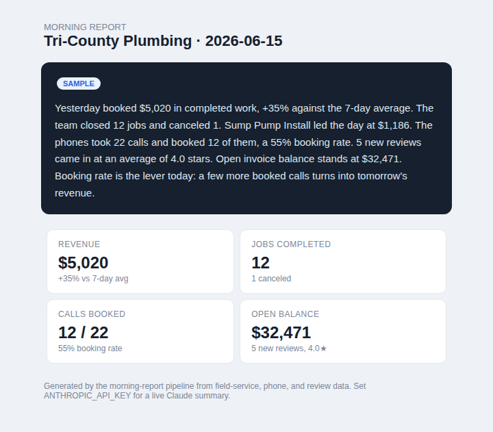
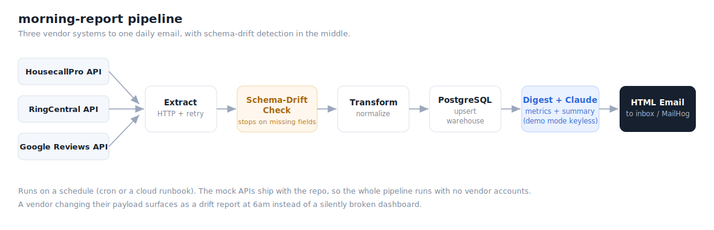

# morning-report

**A service business wakes up to one email that tells it how yesterday went.**

Most service companies run on three or four systems that do not talk to each other. The field-service app knows the jobs. The phone system knows the calls. The reviews live somewhere else. morning-report pulls all of it together overnight and emails the owner a short, plain-language briefing every morning, with the numbers that moved and one thing to watch.

It runs on synthetic data for a fictional plumbing company, so the whole pipeline runs end to end with no vendor accounts.



## What it does for the business

The owner stops logging into three dashboards to piece together how the business is doing. One email, every morning, answers the questions that matter: how much did we book, how many jobs closed, are the phones converting, and is the cash coming in.

## How it works



Five stages, run on a schedule:

1. **Extract.** Pull jobs, invoices, calls, and reviews over HTTP from each source, with retry.
2. **Validate.** Check every record against its source contract. A missing field stops the run and reports which source drifted. This is the part that matters: when a vendor changes their API, you find out at 6am from a clear message, and the warehouse stays clean.
3. **Transform.** Normalize the payloads into clean, typed records.
4. **Load.** Upsert into a PostgreSQL warehouse on the natural key, so reruns are safe.
5. **Digest.** Compute the day against its trailing 7-day average, write the summary, and email an HTML report. The summary comes from Claude when a key is set, and from a committed sample otherwise.

The trailing-average comparison is deliberate. A plain day-over-day number would scream every Monday because the weekend is slow. Comparing to the 7-day average flags real changes instead.

## Quick start

You need Docker. One command brings up the warehouse, the mock vendor APIs, a mail server, and runs the pipeline.

```bash
git clone https://github.com/HenryLabsConsulting/morning-report.git
cd morning-report
docker compose up
```

When it finishes, open **http://localhost:8025**. That is MailHog, a local inbox. The morning report is sitting in it, rendered exactly as the owner would receive it.

The summary is written by a committed template with no key required. For a live Claude-written briefing:

```bash
ANTHROPIC_API_KEY=sk-ant-... docker compose up
```

## Run it without Docker

The pipeline has a dry-run mode that skips the database and builds the report straight from memory. Good for a quick look.

```bash
pip install -r mock_sources/requirements.txt -r pipeline/requirements.txt

# Terminal 1: the mock vendor APIs
python mock_sources/app.py

# Terminal 2: the pipeline
cd pipeline
python run.py --dry-run
open ../samples/daily_digest.html
```

## Pointing it at real systems

The mock APIs imitate HousecallPro, RingCentral, and Google Reviews. To run against the real ones, change the host and add an auth header in `pipeline/extract.py`, and update each source contract in `pipeline/sources.py` to match the live payload. The rest of the pipeline is unchanged.

## Layout

```
morning-report/
  mock_sources/   Flask app serving three vendor APIs from committed fixtures
  pipeline/       extract, validate, transform, load, digest, run + tests
  db/             warehouse schema
  samples/        a committed sample of the rendered report
  docs/           architecture diagram and email preview
  docker-compose.yml
```

## Tests and CI

GitHub Actions runs on every push:

- **Lint** with ruff.
- **Unit tests** for schema-drift detection, transform, and the digest math.
- **End-to-end smoke test** that starts the mock API and runs the pipeline dry-run, then checks the report renders.
- **Full-stack compose test** that runs `docker compose up -d --build` (warehouse, mock APIs, MailHog, and the pipeline container), then asserts the pipeline exits clean and MailHog received a "Morning Report" email. No key is set, so it exercises the demo summary path.

```bash
ruff check pipeline mock_sources
pytest
```

## Data and safety

All data is synthetic and generated by `mock_sources/generate_fixtures.py`. No real client data, no vendor accounts, no keys committed. The Claude key is read from the environment only.

## License

MIT. See [LICENSE](LICENSE).

---

Built by [HenryLabs Consulting](https://github.com/HenryLabsConsulting). Data and automation engineering: BI, custom apps, and AI systems.
